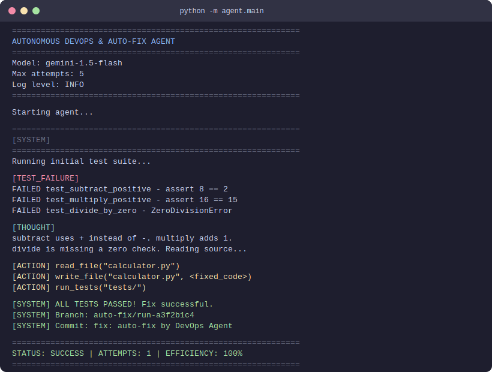
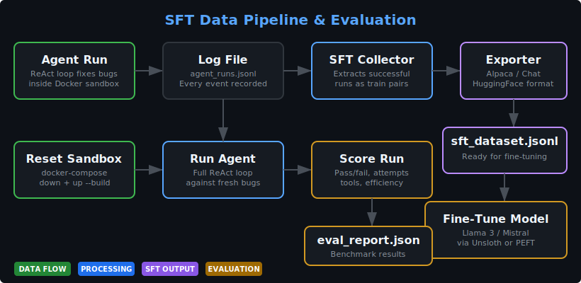

<h1 align="center">Autonomous DevOps & Auto-Fix Agent</h1>

<p align="center">
  <strong>An AI agent that detects failing tests, diagnoses bugs, writes code fixes, and commits them — fully autonomously inside a Docker sandbox.</strong>
</p>

<p align="center">
  
  
  
  
  
</p>

---

## Demo

<p align="center">
  
</p>

---

## What It Does

This agent watches a Python codebase for test failures and fixes them without human input. It runs the full debugging cycle: detect the failure, read the error, analyze the code, write a fix, verify it works, and commit it.

Everything runs inside an isolated Docker container. The agent cannot touch the host machine.

After a successful fix, the agent's logs can be exported as **SFT (Supervised Fine-Tuning) training data** — ready to fine-tune a local model like Llama 3 or Mistral to replicate the agent's behavior.

### The Core Loop

```
  ┌──────────────────────────────────────────────────────────────────┐
  │                                                                  │
  ▼                                                                  │
Run Tests ──► Tests Fail ──► Read Errors ──► Read Source Code        │
                                                  │                  │
                                                  ▼                  │
                                          Write Fix to File          │
                                                  │                  │
                                                  ▼                  │
                                        Re-run Tests to Verify       │
                                           │             │           │
                                        PASS           FAIL          │
                                           │             │           │
                                           ▼             └───────────┘
                                  Create Branch &              (max 5 attempts)
                                  Commit the Fix
```

---

## How It Works

The agent is built on the **ReAct framework** (Reasoning + Acting). Instead of generating one fix and hoping it works, the agent thinks step by step:

```
Step 1 → THOUGHT     The LLM reads the test failure and decides what to do
              ↓
Step 2 → ACTION      The LLM calls a tool (run tests, read a file, write a fix)
              ↓
Step 3 → OBSERVATION  The tool result is sent back to the LLM
              ↓
Step 4 → REPEAT       The LLM uses the new information to take the next step
```

Every tool call passes through a **security guardrail layer** before it runs. Every action is **logged as structured JSON** for full auditability.

---

## SFT Data Pipeline & Evaluation

<p align="center">
  
</p>

The agent generates valuable training data every time it runs. A successful fix is a complete example of: "given this error, here is exactly how to diagnose and fix it."

**The pipeline:**

1. **Collect** — `sft_data_collector.py` reads the agent's `.jsonl` logs and extracts successful runs as training pairs
2. **Export** — `sft_exporter.py` formats the pairs into HuggingFace-compatible JSONL (Alpaca or conversational format)
3. **Evaluate** — `evaluator.py` scores each run on: pass/fail, attempts used, tool efficiency, and duration
4. **Fine-tune** — The exported dataset can be used with Unsloth, PEFT, or TRL to train a local model

**Export formats:**

| Format | Schema | Used by |
|---|---|---|
| Alpaca | `{"instruction", "input", "output"}` | Unsloth, PEFT, Axolotl, LLaMA-Factory |
| Conversational | `{"messages": [{role, content}]}` | TRL SFTTrainer, OpenAI fine-tuning |

**Run the pipeline:**

```bash
# Export SFT training data from agent logs
python -m agent.main --export-sft

# Export in conversational (chat) format
python -m agent.main --export-sft --chat

# Full evaluation: reset sandbox → run agent → score → report
python -m agent.main --evaluate
```

---

## Architecture

```
┌─────────────────────────────────────────────────────────────────────┐
│  HOST MACHINE                                                       │
│                                                                     │
│  agent/main.py                                                      │
│       │                                                             │
│       ├── default ──► agent/react_loop.py (fix bugs)                │
│       ├── --export-sft ──► agent/sft_exporter.py (export data)      │
│       └── --evaluate ──► agent/evaluator.py (score + report)        │
│                                                                     │
│  agent/react_loop.py ◄──── agent/prompt_templates.py                │
│       │                         (system prompt + tool declarations)  │
│       │                                                             │
│       ├── THOUGHT ──► agent/llm_client.py ──► Google Gemini API     │
│       │                                                             │
│       ├── ACTION ──► agent/guardrails.py ──► ALLOWED? ──► tools/*   │
│       │                                      BLOCKED? ──► reason    │
│       │                                        sent back to LLM     │
│       ├── OBSERVATION ──► result fed back into conversation         │
│       │                                                             │
│       └── FIX VERIFIED ──► agent/git_operations.py                  │
│                                                                     │
│  agent/logger.py ──► logs/agent_runs.jsonl                          │
│       │                     │                                       │
│       │                     ▼                                       │
│       │              agent/sft_data_collector.py                    │
│       │                     │                                       │
│       │                     ▼                                       │
│       │              agent/sft_exporter.py ──► data/sft_dataset.jsonl│
│       │                                                             │
│       └──────► agent/evaluator.py ──► data/eval_report.json         │
│                                                                     │
│  ┌──────────────────────────────────────────────────────────────┐   │
│  │  DOCKER CONTAINER (isolated, no network)                     │   │
│  │                                                              │   │
│  │  tools/test_runner.py ──► runs pytest                        │   │
│  │  tools/file_reader.py ──► reads source files                 │   │
│  │  tools/file_writer.py ──► writes fixed code                  │   │
│  │  tools/git_manager.py ──► git add, commit, branch            │   │
│  │  tools/evaluation_runner.py ──► resets sandbox for eval      │   │
│  │                                                              │   │
│  │  sandbox/                                                    │   │
│  │  ├── calculator.py ............. sample code (intentional bugs)│   │
│  │  └── tests/test_calculator.py .. 12 tests (6 pass, 6 fail)  │   │
│  └──────────────────────────────────────────────────────────────┘   │
└─────────────────────────────────────────────────────────────────────┘
```

---

## Features

**Autonomous Debugging** — Detects test failures, reads error logs, analyzes source code, writes fixes, and verifies them in a loop.

**Docker Sandbox** — All code execution happens inside an isolated container with no network access. The host machine is never at risk.

**Security Guardrails** — Every tool call is validated before execution. Blocks path traversal, dangerous code patterns (eval, exec, subprocess), and writes to protected files like tests, config, and agent source code.

**Structured Logging** — Every thought, tool call, and observation is logged as JSON with timestamps and unique run IDs. Full audit trail in `logs/agent_runs.jsonl`.

**Automated Git Workflow** — After a successful fix, the agent creates a branch, generates a conventional commit message (`fix: ...`), and commits the changes.

**SFT Data Pipeline** — Successful fix runs are automatically collected and exported as HuggingFace-compatible training data. Ready for fine-tuning Llama 3, Mistral, or any open-source model.

**Evaluation Framework** — Built-in scoring system measures pass rate, attempt count, tool efficiency, and run duration. Compare Gemini API vs your fine-tuned model.

**Configurable** — Max attempts, model name, log level, container name, and workspace path are all configurable through environment variables.

---

## Project Structure

```
.
├── agent/                        # Core agent logic
│   ├── config.py                 # Loads settings from .env
│   ├── guardrails.py             # Security validation for all tool calls
│   ├── git_operations.py         # High-level git workflow (branch + commit)
│   ├── llm_client.py             # Manages conversation with Gemini API
│   ├── logger.py                 # Structured JSON logging (.jsonl)
│   ├── main.py                   # Entry point — python -m agent.main
│   ├── prompt_templates.py       # System prompt and tool declarations
│   ├── react_loop.py             # Core ReAct loop orchestration
│   ├── sft_data_collector.py     # Extracts training pairs from logs
│   ├── sft_exporter.py           # Exports SFT data in HuggingFace format
│   └── evaluator.py              # Agent scoring and eval reports
│
├── tools/                        # Tool functions (execute inside Docker)
│   ├── test_runner.py            # Runs PyTest inside the container
│   ├── file_reader.py            # Reads files inside the container
│   ├── file_writer.py            # Writes files inside the container
│   ├── git_manager.py            # Low-level git commands inside the container
│   └── evaluation_runner.py      # Resets sandbox for clean eval runs
│
├── sandbox/                      # Sample codebase with intentional bugs
│   ├── calculator.py             # Broken calculator (the agent fixes this)
│   └── tests/
│       └── test_calculator.py    # 12 tests — 6 pass, 6 fail by design
│
├── data/                         # Generated datasets and reports (gitignored)
├── logs/                         # Agent run logs (gitignored, except .gitkeep)
├── assets/                       # SVG diagrams for README
├── Dockerfile                    # Builds the sandbox container
├── docker-compose.yml            # Orchestrates the sandbox service
├── .env.example                  # Template for environment variables
├── requirements.txt              # Python dependencies
└── README.md
```

---

## Getting Started

### Prerequisites

- Python 3.11+
- Docker and Docker Compose
- A free Google Gemini API key — [get one here](https://aistudio.google.com/app/apikey)

### Setup

```bash
# clone the repo
git clone https://github.com/NakuSurrey/The-Autonomous-DevOps-Auto-Fix-Agent.git
cd The-Autonomous-DevOps-Auto-Fix-Agent

# create the .env file from the template
cp .env.example .env

# open .env and add your Gemini API key
# replace "your_gemini_api_key_here" with your actual key

# install Python dependencies
pip install -r requirements.txt

# build and start the Docker sandbox
docker-compose up -d --build
```

### Run the Agent

```bash
python -m agent.main
```

The agent will:
1. Run the test suite inside the Docker container
2. Detect the 6 failing tests
3. Reason about each failure using Gemini
4. Write fixes to the source code
5. Re-run tests to verify each fix
6. Create a branch and commit the successful fix

### Export SFT Training Data

```bash
# After running the agent, export the training data
python -m agent.main --export-sft

# Export in both Alpaca and conversational formats
python -m agent.main --export-sft --both
```

### Run Evaluation

```bash
# Full evaluation: reset sandbox → run agent → score → report
python -m agent.main --evaluate

# Evaluate without resetting (if sandbox is already in broken state)
python -m agent.main --evaluate --no-reset
```

### View Logs

```bash
cat logs/agent_runs.jsonl
```

Each line is one JSON object with: timestamp, run ID, event type, attempt number, and content.

---

## Environment Variables

| Variable | Default | What it does |
|---|---|---|
| `GEMINI_API_KEY` | *(required)* | Your Google Gemini API key |
| `GEMINI_MODEL` | `gemini-1.5-flash` | Which Gemini model to use |
| `MAX_FIX_ATTEMPTS` | `5` | How many fix attempts before giving up |
| `SANDBOX_CONTAINER_NAME` | `devops-agent-sandbox` | Name of the Docker container |
| `SANDBOX_WORKSPACE_PATH` | `/workspace` | Path inside the container |
| `LOG_LEVEL` | `INFO` | Logging level: DEBUG, INFO, WARNING, ERROR |

---

## Security

The guardrail layer validates every tool call before execution:

| Check | What it blocks |
|---|---|
| **Path traversal** | `../` and absolute paths — agent stays inside the workspace |
| **Protected files** | Writes to test files, `.env`, Dockerfile, agent source code |
| **Dangerous patterns** | `import os`, `eval(`, `exec(`, `subprocess.`, `sys.exit(` and 20+ more |
| **Sensitive reads** | `.env` file (contains API keys) |
| **Git validation** | Commits that include protected files in the changeset |

---

## Tech Stack

| Tool | Role |
|---|---|
| **Python 3.11** | Core language for the agent and all tools |
| **Google Gemini API** | LLM for reasoning, code analysis, and fix generation |
| **google-genai SDK** | Official Python client with function calling support |
| **Docker** | Isolated sandbox — no network, no host access |
| **PyTest** | Test framework for failure detection and fix verification |
| **Git** | Version control for branching and committing fixes |
| **HuggingFace (JSONL)** | SFT dataset format for model fine-tuning |

---

## Key Design Decisions

- **Docker isolation over local execution** — The agent writes and runs code. Doing that on the host machine is unsafe. Docker gives a throwaway environment with zero risk.

- **COPY strategy over volume mounts** — Sandbox files are copied into the container at build time. The agent physically cannot access host files.

- **ReAct loop over single-shot generation** — One-shot code generation fails often. The loop lets the agent observe its own mistakes and iterate.

- **Guardrails as a separate layer** — Security checks live in their own module, not scattered across tool functions. One place to audit. One place to update.

- **Structured JSON logging** — Plain text logs are hard to search and filter. JSON lines (.jsonl) format makes every event queryable and each run traceable by ID.

- **Conventional Commits** — Auto-generated commit messages follow the `fix:` prefix standard so they integrate with existing CI/CD tooling.

- **Alpaca format for SFT export** — The most widely supported fine-tuning format. Every major tool (Unsloth, PEFT, TRL, Axolotl) accepts it out of the box.

- **Full Docker rebuild for evaluation** — Guarantees a completely clean sandbox state. Slower than git reset, but correctness matters more than speed in benchmarks.

---

<p align="center">
  Built with Python, Gemini, and Docker.
</p>
